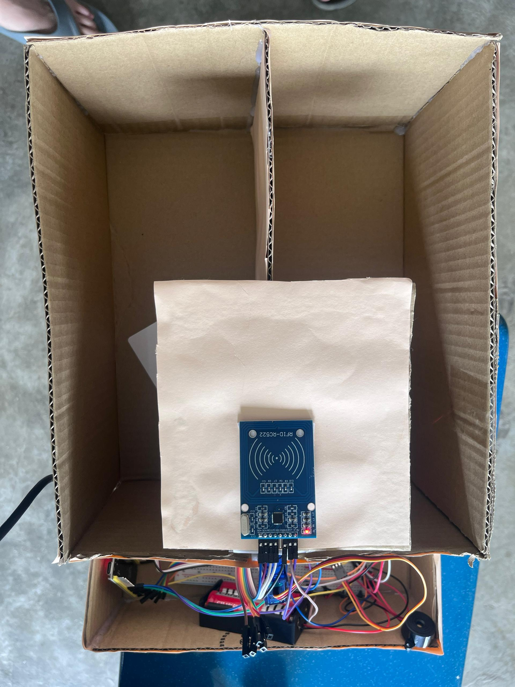

# ESP32 RFID E-Waste Classification System

## 📌 Overview
This project implements an RFID-based waste classification system using ESP32 and a servo motor.

## ⚙️ Features
- RFID tag detection using MFRC522 module
- UID-based classification system
- Servo motor control for automated sorting
- Real-time serial monitoring

## 🛠️ Technologies Used
- ESP32
- MFRC522 RFID Module
- Arduino IDE (C/C++)
- Servo Motor Control

## 📷 Demo

## 🚀 How It Works
When an RFID card is scanned, the system reads the UID and compares it with predefined values. Based on the UID, the servo rotates to direct waste into different categories.

## 📎 Notes
This project demonstrates integration of embedded systems, sensor input, and actuator control.
